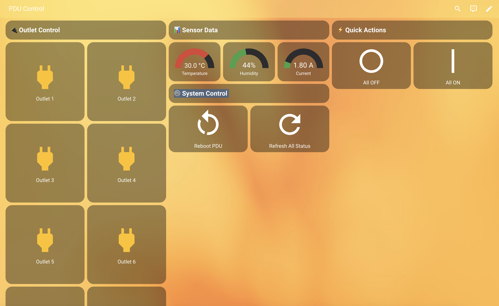

# Universal PDU MQTT Bridge for Home Assistant



> **Control and monitor any rack-mount Power Distribution Unit (PDU) in your datacenter, server room, homelab, or remote site!**

This add-on brings seamless MQTT integration and Home Assistant auto-discovery to a wide range of smart PDUs, including (but not limited to) LogiLink PDU8P01, Intellinet 163682, and most HTTP/XML-based IP PDUs. Perfect for sysadmins, self-hosters, automation enthusiasts, and anyone managing power in racks, network closets, or edge deployments.

**Keywords:** PDU, rack PDU, smart PDU, IP PDU, MQTT, Home Assistant, datacenter, server rack, remote power control, automation, energy monitoring, LogiLink, Intellinet, power strip, network closet, self-hosting, homelab, server room, remote reboot, power monitoring, compatible with most HTTP/XML-based PDUs.

## 🚀 Features
- **Works with most HTTP/XML-based PDUs** (LogiLink, Intellinet, and others)
- **Control 8+ outlets per PDU** (on/off, automation-ready)
- **Monitor temperature, humidity, current draw**
- **Multi-PDU support** (manage all your racks from one dashboard)
- **Auto-discovery and easy setup**
- **Full MQTT integration** (works with any broker)
- **Home Assistant auto-discovery** (entities created automatically)
- **Perfect for datacenters, server rooms, homelabs, remote sites, and edge computing**
- **Open source, no cloud, no vendor lock-in**

## 📸 Example Dashboard
See below for a real Home Assistant dashboard controlling a rack PDU with 8 outlets, live sensor data, and quick actions for remote power management:


## 🏢 Supported Devices
- LogiLink PDU8P01 (8x IEC-C13 smart PDU)
- Intellinet 163682 (8x IEC-C13 smart PDU)
- Most HTTP/XML-based smart PDUs (contact us to add more models!)

## Typical Use Cases
- Datacenter rack power management
- Server room automation
- Homelab and self-hosted infrastructure
- Remote reboot and power cycling
- Energy monitoring and alerting
- Edge computing and network closet control

## ✅ Features

- **Control 8 power outlets per PDU** (on/off) - ⚠️ BETA TESTING
- **Read PDU environment sensors**: temperature, humidity, current
- **Multi-PDU support** (each with a unique name)
- **Auto-discovery** of PDUs on the network
- **MQTT integration** (with `retain: true`)
- **Full configuration via UI**
- **Compatible with the latest Home Assistant version** (2024+)
- **Ready to use as a custom repository in HACS**

## 🚀 Installation (via HACS)

1. Upload this repository to your GitHub:  
   Example: `https://github.com/BitReportPT/homeassistant-addon-logilink-pdu-mqtt`

2. In Home Assistant:
   - Go to `Settings → Add-ons → ... (top right) → Repositories`
   - Add your GitHub link as **type: Add-on repository**
   - It will appear in the add-on store as **LogiLink & Intellinet PDU MQTT Bridge (BETA)**

3. Install and configure it via the UI

## ⚙️ Configuration Options

### Basic Configuration
```yaml
mqtt_host: "192.168.1.10"
mqtt_port: 1883
mqtt_user: "ha"
mqtt_password: "supersecure"
mqtt_topic: "pdu"
auto_discovery: false
discovery_network: "192.168.1"
pdu_list:
  - name: rack_01
    host: "192.168.1.112"
    username: "admin"
    password: "admin"
```

### Auto-Discovery Configuration
```yaml
mqtt_host: "192.168.1.10"
mqtt_port: 1883
mqtt_user: "ha"
mqtt_password: "supersecure"
mqtt_topic: "pdu"
auto_discovery: true
discovery_network: "192.168.1"
pdu_list: []  # Empty - PDUs will be auto-discovered
```

### Multiple PDUs Configuration
```yaml
mqtt_host: "192.168.1.10"
mqtt_port: 1883
mqtt_user: "ha"
mqtt_password: "supersecure"
mqtt_topic: "pdu"
auto_discovery: false
discovery_network: "192.168.1"
pdu_list:
  - name: rack_01
    host: "192.168.1.112"
    username: "admin"
    password: "admin"
  - name: rack_02
    host: "192.168.1.113"
    username: "admin"
    password: "admin"
  - name: server_room
    host: "192.168.1.114"
    username: "admin"
    password: "admin"
```

## 🔍 Auto-Discovery

The add-on can automatically discover PDUs on your network:

1. **Enable auto-discovery** in the configuration
2. **Set the network prefix** (e.g., "192.168.1")
3. **The add-on will scan** for PDUs and test common credentials
4. **Discovered PDUs** will be automatically configured

### Manual Discovery
You can also run the discovery script manually:

```bash
# From the add-on directory
python discover_pdus.py 192.168.1
```

This will:
- Scan the network for PDUs
- Test common credentials (admin/admin, admin/password, etc.)
- Generate a configuration file
- Show you the discovered PDUs

## 📡 MQTT Topics

| Topic                                | Type        | Description               |
|--------------------------------------|-------------|---------------------------|
| `pdu/rack_01/outlet1` to `outlet8`   | State       | Current outlet state      |
| `pdu/rack_01/outletX/set`            | Command     | Send "on" or "off"        |
| `pdu/rack_01/temperature`            | Sensor      | Temperature (°C)          |
| `pdu/rack_01/humidity`               | Sensor      | Humidity (%)              |
| `pdu/rack_01/current`                | Sensor      | Current usage (A)         |

## 🧩 Integration in Home Assistant (example)

```yaml
mqtt:
  switch:
    - name: "Rack 01 - Outlet 1"
      state_topic: "pdu/rack_01/outlet1"
      command_topic: "pdu/rack_01/outlet1/set"
      payload_on: "on"
      payload_off: "off"
      retain: true

  sensor:
    - name: "Rack 01 - Temperature"
      state_topic: "pdu/rack_01/temperature"
      unit_of_measurement: "°C"
```

## 🔧 Troubleshooting

### Common Issues

1. **Add-on won't start**
   - Check MQTT broker connectivity
   - Verify PDU IP addresses are reachable
   - Check logs in Home Assistant → Settings → Add-ons → LogiLink & Intellinet PDU MQTT Bridge (BETA) → Logs

2. **No data from PDU**
   - Test PDU connectivity manually:
     ```bash
     curl -u admin:admin http://YOUR_PDU_IP/status.xml
     ```
   - Verify PDU credentials are correct
   - Check if PDU is accessible from Home Assistant network

3. **MQTT topics not appearing**
   - Verify MQTT broker is running
   - Check MQTT credentials
   - Use MQTT Explorer to monitor topics

4. **Auto-discovery not working**
   - Check if PDUs are on the specified network
   - Verify network connectivity
   - Check logs for discovery errors

### Testing PDU Connection

You can test PDU connectivity using the included test script:

```bash
# From the add-on directory
python test_pdu.py 192.168.1.112 admin admin
```

### Debug Mode

To enable debug logging, edit the add-on configuration and add:

```yaml
log_level: DEBUG
```

### Manual Testing

1. **Test PDU HTTP access:**
   ```bash
   curl -u admin:admin http://YOUR_PDU_IP/status.xml
   ```

2. **Test MQTT connectivity:**
   ```bash
   mosquitto_pub -h YOUR_MQTT_HOST -u YOUR_USER -P YOUR_PASS -t "pdu/test" -m "test"
   ```

3. **Run discovery manually:**
   ```bash
   python discover_pdus.py YOUR_NETWORK_PREFIX
   ```

## 📦 Compatibility

- Tested with: LogiLink PDU8P01, Intellinet 163682
- May work with other similar HTTP/XML-based smart PDUs

## 🐛 Known Issues

- Some PDU models may have different XML structure
- Network timeouts may occur with slow PDU responses
- MQTT retain flag may cause issues with some brokers
- Auto-discovery may take several minutes on large networks
- **BETA: Outlet control needs thorough testing in your environment**

## 📝 Changelog

### v1.2-beta
- **BETA RELEASE** - Marked as beta for safety
- Added auto-discovery functionality
- Improved multi-PDU support with parallel processing
- Enhanced error handling and logging
- Added discovery script for manual PDU detection
- Better MQTT client compatibility
- Added health checks
- Enhanced debugging capabilities
- Fixed import path issues
- **WARNING: Outlet control not fully tested in production**

### v1.1
- Improved error handling and logging
- Better MQTT client compatibility
- Added health checks
- Enhanced debugging capabilities
- Fixed import path issues

---

## 🏗️ Repository Structure

This repository is optimized for Home Assistant Add-on Store compatibility with the following structure:

```
homeassistant-addon-logilink-pdu-mqtt/
├── repository.yaml          # Repository configuration
├── README.md               # This documentation
├── examples/               # Configuration examples
└── pdu_mqtt/              # Main add-on directory
    ├── config.yaml        # Add-on configuration
    ├── manifest.json      # Add-on manifest
    ├── Dockerfile         # Container definition
    └── (Python files)     # Add-on source code
```

**Maintained by:** BitReport.pt

- For issues and feature requests, please visit the [GitHub repository](https://github.com/BitReportPT/homeassistant-addon-logilink-pdu-mqtt).